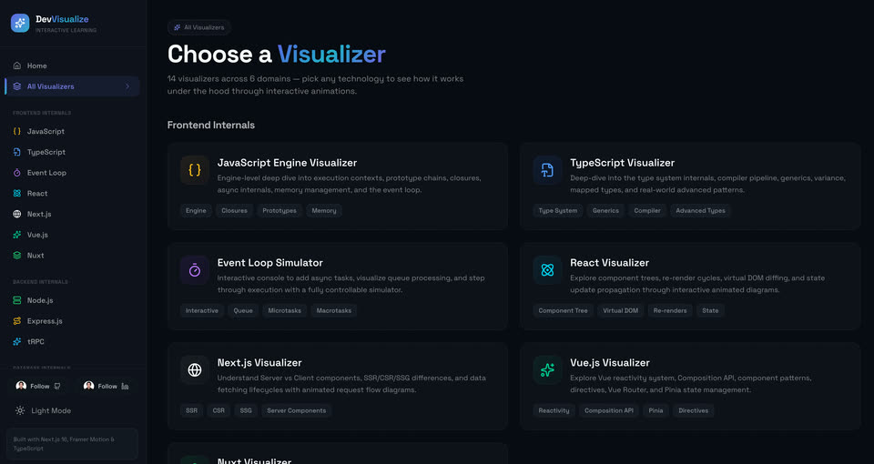
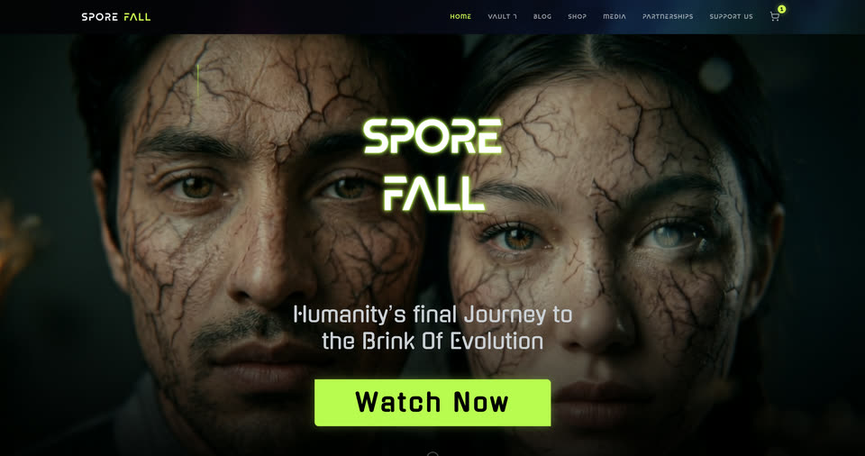
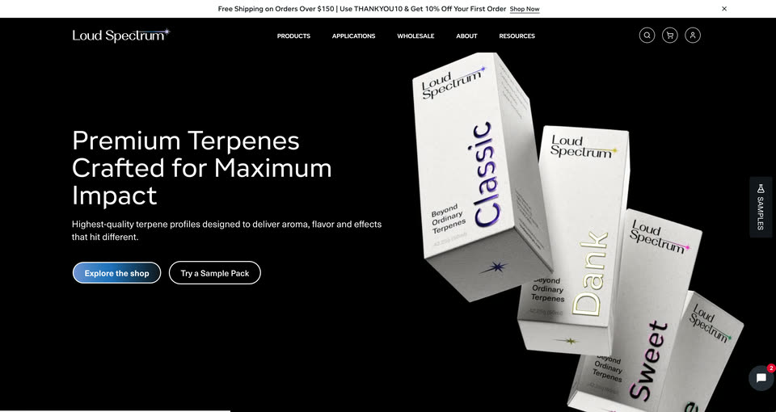

<a href="https://mahmud886.vercel.app">
  <picture>
    <source media="(prefers-color-scheme: dark)" srcset="./.github/readme/banner-dark.svg" />
    <source media="(prefers-color-scheme: light)" srcset="./.github/readme/banner-light.svg" />
    
  </picture>
</a>

<p align="center">
  <a href="https://mahmud886.vercel.app"></a>
  <a href="https://mahmud886.vercel.app/iqbal_mahmud_7_years.pdf"></a>
  <a href="https://www.linkedin.com/in/mahmud886/"></a>
  <a href="https://medium.com/@mahmud886"></a>
  <a href="mailto:iqbal886mahmud@gmail.com"></a>
</p>

<p align="center">
  I'm a <b>Software Engineer</b> with <b>7+ years</b> of building for the web — from agency-scale email and animation work<br />
  to owning the UI of an app used by <b>2M+ people a day</b>. React and Next.js on the inside; performance and motion on the outside.
</p>

<br />

```ts
const iqbal = {
  role: 'Software Engineer',
  based: 'Dhaka, Bangladesh 🇧🇩',
  now: 'Building design-system-driven products @ Adventure Dhaka Limited',
  experience: '7+ years',
  stack: ['React', 'Next.js', 'TypeScript', 'Tailwind', 'Node.js'],
  craft: ['Core Web Vitals', 'component architecture', 'GSAP & Three.js motion'],
  shipped: { dailyUsers: '2M+', emailTemplates: 300, animations: 100 },
  openTo: ['full-time roles', 'contracts', 'hard frontend problems'],
} as const;
```

## 🚀 Featured work

<table>
  <tr>
    <td width="33%" valign="top">
      <a href="https://dev-visualize.vercel.app/"></a>
      <h3><a href="https://dev-visualize.vercel.app/">Dev Visualize</a></h3>
      <sub><b>Interactive learning platform</b></sub>
      <p>Animated, step-by-step visualizers for how the web really works — 12 visualizers, 75 interactive sections, 400+ query examples.</p>
      <sub><code>Next.js 16</code> <code>React 19</code> <code>TypeScript</code> <code>Framer Motion</code></sub>
      <p><a href="https://mahmud886.vercel.app/projects/dev-visualize">Case study →</a></p>
    </td>
    <td width="33%" valign="top">
      <a href="https://www.sporefall.com/"></a>
      <h3><a href="https://www.sporefall.com/">Sporefall</a></h3>
      <sub><b>Gen-AI sci-fi micro-drama platform</b></sub>
      <p>Southeast Asia's first audience-voted micro-drama: public site with Stripe checkout, an internal CMS, and a drag-and-drop campaign engine.</p>
      <sub><code>Next.js 16</code> <code>Supabase</code> <code>Stripe</code> <code>Zustand</code></sub>
      <p><a href="https://mahmud886.vercel.app/projects/sporefall">Case study →</a></p>
    </td>
    <td width="33%" valign="top">
      <a href="https://loudspectrum.com/en"></a>
      <h3><a href="https://loudspectrum.com/en">Loud Spectrum</a></h3>
      <sub><b>Production e-commerce · USA</b></sub>
      <p>Storefront for a terpene manufacturer: accounts, dynamic pricing rules, admin dashboards — engineered for sub-second LCP.</p>
      <sub><code>Next.js</code> <code>Tailwind</code> <code>Storybook</code> <code>PostgreSQL</code></sub>
      <p><a href="https://mahmud886.vercel.app/projects/loud-spectrum">Case study →</a></p>
    </td>
  </tr>
</table>

<details>
  <summary><b>Also built</b> — Noor · RestaurantOS · Khan Associates · AVYRA</summary>
  <br />

| Project | What it is | Stack |
|---|---|---|
| **Noor** | Calm, Bangla-first Islamic companion — prayer times, Quran and dhikr | Next.js 16 · next-intl · Tailwind v4 |
| **RestaurantOS** | Multi-tenant, dynamic-QR restaurant SaaS with per-restaurant subdomains | Next.js 16 · TypeScript · Framer Motion |
| **Khan Associates** | Bilingual site for a Dhaka tax & legal firm — zero UI kits, hand-rolled icons | Next.js 16 · React 19 · Tailwind v4 |
| **AVYRA** | Universal commerce design system: one codebase, many storefronts | Next.js 16 · design tokens |

</details>

## 💼 Experience

```diff
@@ git log --career --oneline @@
+ 2024 → now   Software Engineer   @ Adventure Dhaka Limited      design systems · SSR · testing · CI/CD
  2023 → 2024  Web Developer       @ Nexdecade Technology         2M+ daily users · +25% perf · -62% debugging time
  2021 → 2023  Web Developer       @ Hogarth Dhaka                300+ email templates · 100+ GSAP animations
  2021         Web Developer       @ Kaizen IT                    full-stack React · Node · MongoDB
  2021         Web Developer       @ Oxdora iTech                 first production websites
```

<sub>🎓 B.Sc. in Computer Science & Engineering — Southeast University · 📜 Reactive Accelerator (LWS) · Complete Web Development (Programming Hero) · <a href="https://mahmud886.vercel.app/resume">Full resume →</a></sub>

## 🧰 Toolbox

<p>
  <b>Frontend</b><br />
  
</p>
<p>
  <b>Motion & 3D</b><br />
  
  
  
</p>
<p>
  <b>Backend & data</b><br />
  
</p>
<p>
  <b>Quality & shipping</b><br />
  
</p>

## 📊 GitHub

<p align="center">
  <picture>
    <source media="(prefers-color-scheme: dark)" srcset="https://streak-stats.demolab.com?user=mahmud886&theme=transparent&hide_border=true&ring=FF6A33&fire=FF6A33&currStreakLabel=FF6A33&sideLabels=ECEBE6&currStreakNum=ECEBE6&sideNums=ECEBE6&dates=8B8A92" />
    
  </picture>
</p>
<p align="center">
  <picture>
    <source media="(prefers-color-scheme: dark)" srcset="https://raw.githubusercontent.com/mahmud886/mahmud886/output/snake-dark.svg" />
    <source media="(prefers-color-scheme: light)" srcset="https://raw.githubusercontent.com/mahmud886/mahmud886/output/snake-light.svg" />
    
  </picture>
</p>

## ✍️ Latest writing

<!-- BLOG-POST-LIST:START -->
- [10 Basic Interview Questions — Fluid Design and Vue.js](https://medium.com/@mahmud886/10-basic-interview-questions-fluid-design-and-vue-js-7ddb2f4f02a3) <sub>· May 2020</sub>
- [10 JavaScript Coding Interview Questions Solved With Code](https://medium.com/swlh/10-javascript-coding-interview-questions-solve-with-code-3d0a22393a69) <sub>· May 2020</sub>
- [10 Days of JavaScript — HackerRank Problems Solved](https://medium.com/@mahmud886/10-days-of-javascript-hackerrank-problem-solve-d5520b858c9d) <sub>· May 2020</sub>
- [React Interview Questions](https://medium.com/@mahmud886/react-interview-questions-9ecc07d3a5ec) <sub>· May 2020</sub>
- [10 JavaScript Interview Questions](https://medium.com/@mahmud886/10-javascript-interview-questions-ee31a3c1a742) <sub>· May 2020</sub>
<!-- BLOG-POST-LIST:END -->

## 🤝 Let's build something

I'm open to **full-time roles, contracts and hard frontend problems**. The fastest way to reach me is email — I reply within a day.

<p>
  <a href="mailto:iqbal886mahmud@gmail.com"></a>
  <a href="https://www.linkedin.com/in/mahmud886/"></a>
  <a href="https://discord.gg/Snigdho93"></a>
  <a href="https://www.facebook.com/snigdho121"></a>
</p>

<sub>This repo is also the source of my portfolio — Next.js 16 on Vercel. <a href="./docs/DEVELOPMENT.md">How it's built →</a> · </sub>
